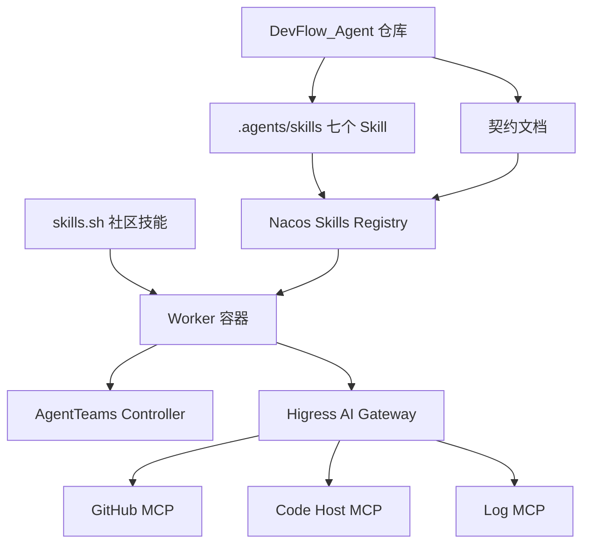

# AgentTeams Toolkit 设计

Feature Name: agentteams-toolkit
Updated: 2026-07-31

## Description

AgentTeams Toolkit 是 DevFlow_Agent 面向 AgentTeams 运行时交付的可复用工具包。工具包以仓库制品（`.agents/skills` 下七个 Skill 定义）与四类契约文档（Skill 契约、MCP 工具契约、声明式资源契约、PROCESS DAG 调度契约）构成，经 Nacos 治理版本与灰度，兼容 skills.sh 社区技能。

工具包不包含独立服务进程；其运行时载体是 AgentTeams Controller 与 Worker 容器。Worker 零真实凭据，全部外部调用经 Higress AI Gateway 以 consumer token 转发。

## Architecture



- 仓库 `A` 以 `.agents/skills` 提供七个 Skill，注册到 Nacos `D`，Worker `F` 按需拉取确定性版本。
- Worker `F` 与 Controller `G` 交互获得资源契约；外部工具调用经网关 `H` 转发到 GitHub/Code Host/Log MCP（`I`/`J`/`K`）。

## Components and Interfaces

### 七个 Skill 制品

每个 Skill 位于 `.agents/skills/<name>/SKILL.md`，统一契约字段：

| 字段 | 类型 | 说明 |
| --- | --- | --- |
| name | string | Skill 唯一标识 |
| role | string | 绑定角色（triage/architect/developer/reviewer/qa/retro） |
| triggers | string[] | 触发条件描述 |
| inputs | string[] | 输入要求 |
| outputs | string[] | 产出制品 |
| permissions | string[] | 权限与凭据范围 |

七个 Skill 及职责：

| Skill | 角色 | 关键产出 |
| --- | --- | --- |
| triage | Triage Worker | Proposal issue 与 QUESTION 决策清单 |
| root-cause | Architect Worker | Design issue：根因与验收标准 |
| implement | Developer Worker | PROCESS DAG 节点对应代码变更 PR |
| review | Reviewer Worker | REVIEW typed comment（P0/P1 findings） |
| verify | QA Worker | verify --json 输出（PASS/FAIL + reasons） |
| retro | Retro Worker | durable spec PR 归档 |
| spec-sync | 编排层 | stage 切换与 typed comment 同步 |

### 契约文档

| 契约 | 文件 | 内容 |
| --- | --- | --- |
| Skill 契约 | `.agents/skills/*/SKILL.md` | 七个 Skill 的五项统一契约字段 |
| MCP 工具契约 | `docs/contracts/mcp-integration.md` | GitHub/Code Host/Log MCP 接入方式、权限、凭据边界 |
| 资源契约 | `docs/contracts/resource-contract.md` | Worker/Team/Human/Manager CR 字段定义 |
| DAG 调度契约 | `docs/contracts/process-dag.md` | PROCESS 节点、依赖、并行判定规则 |

### verify 输出接口

verify Skill 输出可机读 JSON，结构固定：

```json
{
  "change": "issue-123",
  "status": "PASS",
  "blocking_questions": 0,
  "traceability": "ok",
  "p0_p1_open": 0,
  "pr_checks": "passed",
  "reasons": ["all gates satisfied"]
}
```

## Data Models

### Worker 资源契约

```yaml
apiVersion: agentteams.io/v1
kind: Worker
metadata:
  name: qa-worker
spec:
  runtime: openclaw
  role: qa
  spec:
    env:
      SKILLS_API_URL: nacos://market.agentteams.io:80/public
  soul: |
    你是质量保障 Agent，负责 verify 门禁。
  token:
    type: consumer
```

### Team 资源契约

```yaml
apiVersion: agentteams.io/v1
kind: Team
metadata:
  name: devflow-team
spec:
  members: []
  workers: [triage-worker, architect-worker, developer-worker, reviewer-worker, qa-worker, retro-worker]
  humans: [dev-lead]
```

### Human 资源契约

```yaml
apiVersion: agentteams.io/v1
kind: Human
metadata:
  name: dev-lead
spec:
  permission: high
  room: "#devflow-project"
```

### PROCESS DAG 节点模型

```json
{
  "id": "process-B",
  "name": "修复后端",
  "owner": "developer-worker",
  "dependencies": [],
  "parallel": ["process-C"],
  "status": "RUNNING",
  "evidence": "https://github.com/.../pull/45"
}
```

## Correctness Properties

- **C1 凭据隔离**：任意 Worker 的 `token.type` 恒为 `consumer`，真实凭据仅存于 Higress 网关。
- **C2 契约完备**：七个 Skill 均包含 name、role、triggers、inputs、outputs、permissions 六字段。
- **C3 DAG 无环**：PROCESS 依赖关系构成有向无环图，任何路径不存在环。
- **C4 并行安全**：两个 PROCESS 节点写域不重叠时才标记并行。
- **C5 verify 确定性**：verify 输出仅由六项固定字段与 reasons 构成，同一输入恒产生同一结果。

## Error Handling

| 场景 | 处理 |
| --- | --- |
| Nacos 技能拉取失败 | Worker 回退使用仓库自带 `.agents/skills` 副本，记录告警 |
| MCP 工具不可用 | 网关返回错误码，Worker 将该节点标记为失败并通知 Manager |
| consumer token 失效 | 网关返回 401，Worker 停止任务并请求重新签发 |
| PROCESS 依赖死锁 | 调度器超时检测环与等待超时，阻断并通知 Human |
| verify 数据缺失 | verify 输出 `status: FAIL` 并列出缺失证据项 |

## Test Strategy

- **契约校验测试**：脚本校验七个 SKILL.md 均含六字段，使用 vitest。
- **verify 输出测试**：对 PASS/FAIL/边界输入运行 verify 解析器单测，验证六字段完整性。
- **DAG 无环测试**：基于样例 DAG 图运行拓扑排序校验，使用 fast-check 生成随机图。
- **集成验证**：复用 `install/agentteams-verify.sh` 的只读连通性检查模式，验证 Worker 拉取技能链路。
- **L0-L3 分级测试**：为每个风险等级构造动作样例，验证审批拦截是否生效。

## References

[^1]: (Website) - [GOAI 2026 DevFlow Agent 方案PPT](https://monkeycode-temporary.oss-cn-hangzhou.aliyuncs.com/)
[^2]: (install/agentteams-install.sh#L3465) - `AGENTTEAMS_SKILLS_API_URL` Nacos 技能市场默认值
[^3]: (src/components/dashboard/sections/skills-section.tsx) - 现有孤儿 Skills 组件的技能推导逻辑
[^4]: (src/lib/agentteams-api.ts#L39) - `WorkerResponse.skills` 与 `mcpServers` 字段
