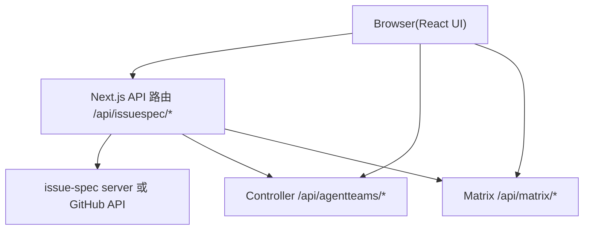

# Issue-Spec Tracking 设计

Feature Name: issue-spec-tracking
Updated: 2026-07-31

## Description

Issue-Spec Tracking 在 DevFlow_Agent Dashboard 上新增 issue-spec 链路追踪与任务管理能力。模块以自研 API 代理层为数据源，前端以标准类型渲染 Proposal/Design/Implement 三阶段工作流、PROCESS DAG 面板、verify 门禁看板、Human 审批流与变更看板任务列表。

模块完全复用现有 Dashboard 架构模式：浏览器不直连后端，全部经 Next.js API 路由代理；数据用 TanStack Query 缓存；UI 用 shadcn/ui 组件；新 section 挂载进现有 sectionMap 与导航。

## Architecture



- 新增 `/api/issuespec/*` 代理路由，作为 issue-spec 数据源的统一入口，仿照 `proxy-helper.ts` 模式实现请求转发与错误归一化。
- 前端 section 复用现有 dashboard 骨架，经 hash 路由挂载。

## Components and Interfaces

### 后端代理层

新增 `src/app/api/issuespec/` 路由组，仿照 `/api/agentteams/` 模式：

| 路由 | 方法 | 职责 |
| --- | --- | --- |
| `/changes` | GET | 变更列表（跨 Proposal/Design/Implement） |
| `/changes/[id]` | GET | 单变更详情（三阶段状态与 typed comment） |
| `/changes/[id]/timeline` | GET | typed comment 时间线 |
| `/changes/[id]/dag` | GET | PROCESS DAG 节点与依赖 |
| `/changes/[id]/tasks` | GET | TASK 任务单元列表 |
| `/changes/[id]/verify` | GET | verify 结果（含 --json 原始输出） |
| `/changes/[id]/approvals` | GET/POST | L3 审批卡片查询与审批动作提交 |
| `/gateways/verify` | POST | 触发 verify 门禁执行 |

数据源适配：本期对接 issue-spec server（HTTP JSON 接口）；当后端不可用时回退到可配置的标准接口（GitHub API 经 code-provider bridge），确保前端类型稳定。

### 前端新增组件

| 组件 | 位置 | 职责 |
| --- | --- | --- |
| SpecWorkflowSection | `sections/spec-workflow-section.tsx` | 三阶段工作流视图，挂载进 sectionMap（key: `spec`） |
| ChangeBoardSection | `sections/change-board-section.tsx` | 变更看板 + 任务列表，挂载进 sectionMap（key: `tasks`） |
| ProcessDagPanel | `sections/spec/process-dag-panel.tsx` | PROCESS DAG 节点与依赖渲染 |
| VerifyPanel | `sections/spec/verify-panel.tsx` | verify 门禁结果看板 |
| ApprovalCard | `sections/spec/approval-card.tsx` | L3 tool guard approval 审批卡片 |
| TypedCommentTimeline | `sections/spec/typed-comment-timeline.tsx` | 六类 typed comment 时间线 |

导航新增两项：`nav-items.ts` 增加 `spec`（Spec 工作流）与 `tasks`（变更看板）。

### 数据访问层

新增 `src/lib/issuespec-api.ts`，仿照 `agentteams-api.ts` 模式：
- 类型定义（`ChangeSummary`/`ChangeDetail`/`ProcessNode`/`TaskItem`/`VerifyResult`/`TypedComment`）
- `proxyRequest()` 统一封装（base `/api/issuespec`）
- `issuespecApi` 对象提供上述路由对应方法

### Hooks

新增 hooks，仿照现有 `use-agentteams-*` 模式：
- `use-issuespec-changes.ts`：变更列表（10s 轮询，key `['issuespec-changes']`）
- `use-issuespec-change-detail.ts`：单变更详情
- `use-issuespec-dag.ts`：DAG 数据
- `use-issuespec-tasks.ts`：任务列表
- `use-issuespec-verify.ts`：verify 结果
- `use-issuespec-mutations.ts`：审批提交、verify 触发，统一 `invalidateQueries` + `auditMutation` + toast

## Data Models

### ChangeSummary

```typescript
interface ChangeSummary {
  id: string;
  stage: 'proposal' | 'design' | 'implement';
  title: string;
  repo: string;
  status: 'open' | 'in_progress' | 'blocked' | 'archived' | 'failed';
  updatedAt: string;
}
```

### VerifyResult

```typescript
interface VerifyResult {
  change: string;
  status: 'PASS' | 'FAIL';
  blocking_questions: number;
  traceability: 'ok' | 'broken';
  p0_p1_open: number;
  pr_checks: 'passed' | 'failed';
  reasons: string[];
}
```

### ProcessNode

```typescript
interface ProcessNode {
  id: string;
  name: string;
  owner: string;
  dependencies: string[];
  parallelWith: string[];
  status: 'PENDING' | 'RUNNING' | 'COMPLETED' | 'FAILED';
  evidence?: string;
}
```

### TypedComment

```typescript
interface TypedComment {
  id: string;
  type: 'SPEC' | 'QUESTION' | 'ANSWER' | 'TASK' | 'PROCESS' | 'REVIEW' | 'VERIFY';
  author: string;
  createdAt: string;
  content: string;
  changeId: string;
}
```

## Correctness Properties

- **CP1 只读代理**：新增 API 路由除审批提交与 verify 触发外均为 GET，服务端不落库。
- **CP2 状态一致**：ChangeSummary.stage 与 TypedComment 时间线一致，任一阶段切换同步更新列表。
- **CP3 门禁锁存**：VerifyResult.status 为 FAIL 时，前端不提供归档操作入口。
- **CP4 审批留痕**：每次审批动作写入 audit store，保留完整回放链路。
- **CP5 并行标注**：ProcessNode.parallelWith 仅在与依赖判定不冲突时填充。

## Error Handling

| 场景 | 处理 |
| --- | --- |
| issue-spec server 不可达 | 返回标准化错误，前端 `isUnsupportedEndpointError` 降级展示空态 |
| verify 数据缺失 | VerifyPanel 展示 FAIL 与缺失证据项，不伪造 PASS |
| Matrix 房间同步失败 | 保留本地已加载消息，顶部展示连接告警 |
| 审批动作失败 | 拦截动作并提示重试，不产生半提交状态 |
| DAG 数据循环引用 | 前端拓扑渲染容错，异常节点标记并提示后端数据问题 |

## Test Strategy

- **API 路由单测**：vitest 测试 `/api/issuespec/*` 各路由的请求转发、错误归一化与超时（mock 后端）。
- **类型渲染测试**：Testing Library 测试六类 typed comment 与 verify 结果各状态渲染。
- **门禁逻辑测试**：verify FAIL 时归档入口禁用、审批动作调用审计写入。
- **DAG 渲染测试**：空图、单节点、并行、循环引用四类样例渲染验证。
- **集成测试**：结合 Matrix mock 房间消息流，验证 spec section 与现有 chat 的 A2UI 富文本渲染共存。

## References

[^1]: (Website) - [GOAI 2026 DevFlow Agent 方案PPT](https://monkeycode-temporary.oss-cn-hangzhou.aliyuncs.com/)
[^2]: (src/app/api/agentteams/proxy-helper.ts#L77) - `proxyToAgentTeams` 代理模式
[^3]: (src/lib/agentteams-api.ts#L301) - `proxyRequest` 统一封装模式
[^4]: (src/components/dashboard/agent-teams-dashboard.tsx#L42) - sectionMap 懒加载挂载
[^5]: (src/components/dashboard/nav-items.ts#L24) - 主导航定义
[^6]: (src/hooks/use-agentteams-mutations.ts#L31) - mutation 统一模式
[^7]: (src/lib/a2ui/parser.ts#L48) - A2UI 双格式解析
